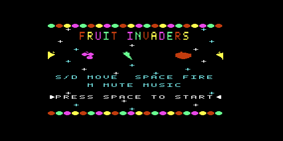
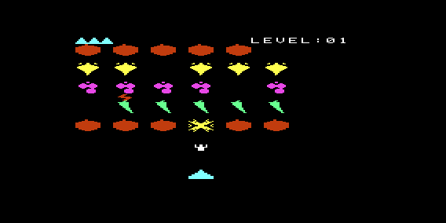

# Fruit Invaders

[](https://github.com/aboudou/fruit-invaders/actions/workflows/build-release.yml)

A *Space Invaders* clone for the Commodore VIC-20, where the invaders are
pixelated fruits and vegetables — text-mode pseudo-graphics only (custom
character set redefined in RAM), no hardware sprites, no bitmap mode. See
[CLAUDE.md](CLAUDE.md) for the full design/technical documentation.

## Screenshots

| Title screen | Gameplay |
|---|---|
|  |  |

## Controls

| Key     | Action                                  |
|---------|------------------------------------------|
| `S`     | Move left                               |
| `D`     | Move right                              |
| `Space` | Fire / start / confirm                  |
| `M`     | Toggle background music (title screen)  |

## Hardware requirements

Target: Commodore VIC-20, **PAL**.

This game needs more RAM than a bare VIC-20 provides, via a memory
expansion cartridge (or an emulator's equivalent expansion setting). The
minimum required configuration is **expansion blocks 1, 2 and 3 active**
(block 4 stays inactive):

| Block | Address range     | Size  |
|-------|--------------------|-------|
| 1     | `$2000`–`$3FFF`    | +8 KB |
| 2     | `$4000`–`$5FFF`    | +8 KB |
| 3     | `$6000`–`$7FFF`    | +8 KB |

That's 24 KB usable — one of the SDK's standard contiguous `0/3/8/16/24` KB
presets, but the project still links against a
[custom linker script](link/vic20-fruit-invaders.ld) for an unrelated
reason (a reserved character-memory window), and that script also keeps
two more blocks (0 and 5, +3 KB and +8 KB) provisioned but currently unused
for future growth — see [link/README.md](link/README.md) and CLAUDE.md's
"Target hardware".

## Toolchain

Built with the **[llvm-mos SDK](https://github.com/llvm-mos/llvm-mos-sdk)**,
a fork of LLVM/Clang retargeted at 6502-family CPUs, via its VIC-20
platform (`mos-vic20-clang`/`mos-vic20-clang++`).

```bash
mos-vic20-clang \
    -Os -T link/vic20-fruit-invaders.ld -o game.prg \
    src/main.c src/gameplay/title.c src/gameplay/game.c \
    src/graphics/sprites.c src/graphics/screen.c src/graphics/font.c \
    src/graphics/bigfont.c src/graphics/decor.c src/graphics/charmem.c \
    src/sound/sound.c
```

## Debugging / testing

Testing is done in the [VICE](https://vice-emu.sourceforge.io/) emulator,
driven live from Claude Code through
**[VICE MCP](https://github.com/barryw/vice-mcp)** — a VICE build with a
native MCP server compiled in (`--enable-mcp-server`). It exposes memory/
register inspection, execution control, breakpoints, disassembly,
keyboard/joystick injection, display screenshots, and VIC-II/CIA/SID
state over MCP, so each development step can be checked against real
emulator state instead of guesswork.

Being an HTTP MCP server, it has to be started manually before use:

```bash
xvic -mcpserver
```

See CLAUDE.md's "Debugging / testing" section for the exact local paths
and known gotchas.

## Project status

Early development — see CLAUDE.md's "Current project state" for what's
implemented so far and what's still open.
